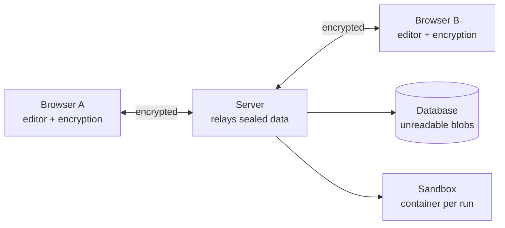

# Enclave
**we are building an editor which cant read what we write

**A collaborative code editor where the server cannot read your code.**

Two people open the same link, write code together in real time, and run it.
Everything is encrypted in the browser before it is sent, so the server in the
middle only ever handles data it cannot decrypt.

## The idea

Collaborative coding tools ask you to trust whoever runs the server with your
source code. Usually that is fine. It is also avoidable.

Enclave removes that trust:

1. **The server cannot read the session.** Text is encrypted in the browser
   before it reaches the network.
2. **Code runs in a locked box.** Untrusted code executes in a container with no
   network, capped memory, and a hard timeout.
3. **The record cannot be forged.** Session events are hash-chained, so any
   later edit is detectable — including by whoever runs the server.

---

## How it fits together



The key that decrypts a room lives in the URL fragment:

```
https://host/room/7f3a91#k=<key>
```

Browsers never send the part after `#` to the server. So the key reaches the
other participant through the link itself, and the server never sees it. This
also means there are no accounts to build — but it means there is no revocation
either, and anyone with the link is in.

---

## Stack

Vite + React + Monaco on the front. Node + Fastify, Postgres, and Redis on the
back. Yjs for conflict-free real-time sync, libsodium for cryptography, Docker
for the execution sandbox.

---

## Running it

```bash
docker compose up -d
cp apps/server/.env.example apps/server/.env
npm install
npm run db:migrate --workspace=@enclave/server
npm run dev
```

---

## Progress

**Phase 1 — Skeleton**
- [x] Postgres + Redis via Docker Compose
- [x] Append-only event schema
- [x] Room creation and replay endpoints
- [ ] Editor wired up to a room
- [ ] Deployed with HTTPS

**Phase 2 — Real-time sync**
- [ ] WebSocket relay
- [ ] Yjs CRDT sync between browsers
- [ ] Reconnect without losing work

**Phase 3 — Encryption**
- [ ] Key derived from the URL fragment
- [ ] Every update encrypted with AES-GCM
- [ ] Key ratcheting for forward secrecy

**Phase 4 — Sandbox**
- [ ] Container-per-run execution
- [ ] Resource limits and seccomp profile
- [ ] Job queue and workers
- [ ] Attack suite proving containment

**Phase 5 — Verifiable transcript**
- [ ] Hash-chained event log
- [ ] Merkle tree and inclusion proofs
- [ ] Standalone verifier
