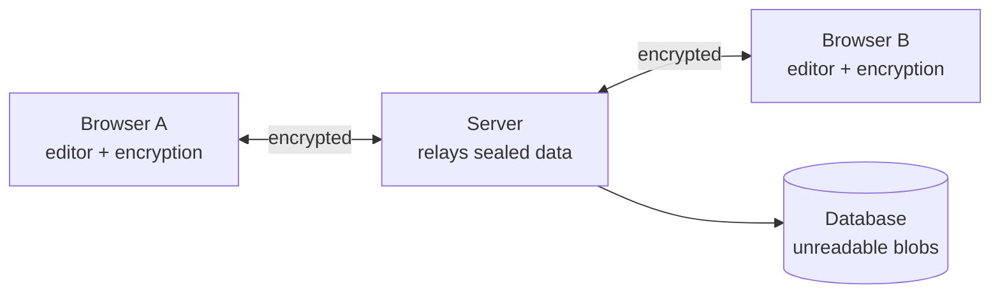

# Enclave

**A collaborative code editor where the server cannot read your code.**

Two people open the same link and write code together in real time. Everything
is encrypted in the browser before it is sent, so the server in the middle only
ever handles data it cannot decrypt.

> **Working, not deployed yet.** See [Progress](#progress) for what is built.
> Nothing is claimed as finished until its box is ticked, and
> [Known limits](#known-limits) says what this does *not* do.

---

## The idea

Collaborative coding tools ask you to trust whoever runs the server with your
source code. Usually that is fine. It is also avoidable.

Enclave removes that trust:

1. **The server cannot read the session.** Text is encrypted in the browser
   before it reaches the network.
2. **The record cannot be forged.** Session events are hash-chained, so any
   later edit is detectable — including by whoever runs the server.

---

## How it fits together



The key that decrypts a room lives in the URL fragment:

```
https://host/room/7f3a91#k=<key>
```

Browsers never send the part after `#` to the server. So the key reaches the
other participant through the link itself, and the server never sees it. This
also means there are no accounts to build — but it means there is no revocation
either, and anyone with the link is in.

---

## What the server actually stores

Type a secret into a room, then look in the database:

```sql
SELECT seq, encode(nonce,'hex'), encode(ciphertext,'hex') FROM "Event";
```

```
 seq |          nonce           |              ciphertext
-----+--------------------------+--------------------------------------
   0 | c0bf54c8129db70b95fa1047 | 681eb4709d3fb66d8d96c948efa8921bf868…
   1 | 3fa9b3e0ed3ef6a5a6c82a77 | bcbdf24afe674c9eae9de973c7f75d057b00…
```

Searching those rows for the plaintext returns zero matches.

---

## Verify the record yourself

The server could still lie about *what happened* — drop an event, reorder two,
swap one out. Every event is hash-chained and committed to a Merkle root, so
that is detectable without trusting the server at all.

`tools/verify-transcript.mjs` has zero dependencies and imports nothing from
this app. It deliberately reimplements the hashing from the spec, so a bug in
the library cannot hide behind the same bug in the checker:

```bash
curl .../api/rooms/<id>/transcript > t.json
curl .../api/rooms/<id>/proof/40   > p.json
node tools/verify-transcript.mjs t.json p.json
```

```
hash chain
  ok    65 events chain unbroken from genesis
  ok    head 7ab0940bc8399edf…

merkle root
  ok    recomputed root matches: d1c442b705e7be44…

inclusion proof
  ok    event 40 is in the log under root 0cRCtwXnvkRI…
  ok    path length 7 for a log of 65

VERIFIED
```

Change one byte of any ciphertext and it fails on both the chain and the root.
Leave the chain intact but edit the published root and only the root check
catches it — the two are independent guarantees, not one implying the other.

The inclusion proof is the reason for the tree rather than just the chain: it
proves one event is in the log in `O(log n)` hashes, **without disclosing the
other 64**.

---

## Stack

Vite + React + Monaco on the front. Node + Fastify and Postgres on the back.
Yjs for conflict-free real-time sync, WebCrypto for encryption.

---

## Running it

Needs **Node 22+** and Docker.

```bash
docker compose up -d                  # postgres
cp apps/server/.env.example apps/server/.env
npm install                           # also generates the prisma client
npm run db:migrate
npm run dev                           # server :3001, client :5173
```

```bash
npm test        # 40 tests across the crypto and merkle packages
npm run typecheck
```

### Deploying

One service, one origin: Fastify serves the built client, the API, and the
WebSocket relay together. See [`render.yaml`](render.yaml).

```bash
npm run build --workspace=@enclave/web   # client -> apps/web/dist
npm run start --workspace=@enclave/server # migrates, then serves everything
```

Set `DATABASE_URL`. Optionally `MAX_EVENTS_PER_ROOM` (default 50,000) and
`ROOM_RETENTION_DAYS` (default 30) — rooms idle longer than that are deleted
hourly, and their events go with them.

> **This cannot be scaled past one instance.** Presence lives in memory and
> appends are serialised in-process — a second instance would fork the hash
> chain. Fixing it needs external pub/sub for presence and a Postgres advisory
> lock around appends.

---

## Progress

**Phase 1 — Skeleton**
- [x] Postgres via Docker Compose
- [x] Append-only event schema
- [x] Room creation and replay endpoints
- [x] Editor wired up to a room
- [x] Editor bundled locally, no third-party CDN
- [ ] Deployed with HTTPS

**Phase 2 — Real-time sync**
- [x] WebSocket relay with rooms, heartbeat, and presence
- [x] Yjs CRDT sync between browsers
- [x] Append-only event log with hash-chained entries
- [x] Reconnect with exponential backoff, replaying only unseen events

**Phase 3 — Encryption**
- [x] Key generated in the browser, carried in the URL fragment
- [x] Every update sealed with AES-GCM-256
- [x] Hash ratchet, new epoch every 50 messages
- [x] Tamper detection surfaced in the UI
- [x] 15 unit tests over the crypto layer

**Phase 4 — Code execution** — _cut_

Enclave does not run code. It is an editor. Executing untrusted code safely is
a second project, and shipping the sandbox without the attack suite that proves
it would have meant claiming containment I hadn't demonstrated.

**Phase 5 — Verifiable transcript**
- [x] Merkle tree and inclusion proofs (RFC 6962)
- [x] Standalone verifier, zero dependencies
- [x] Verifier agreement tests — the tool is checked against the library it
      deliberately does not import
- [x] Consolidate the duplicated Merkle implementation

---

## Known limits

Stated up front, because a security project that only lists its strengths isn't
one:

- **The server delivers the JavaScript that does the encryption.** A hostile
  operator could ship a build that copies plaintext before sealing it. Bundling
  Monaco locally narrows the trusted set from "us + every CDN" to "us" — it
  can't reach zero in a browser.
- **The ratchet protects against a leaked epoch key, not a leaked link.** The
  root key lives in the URL fragment, so anyone with the link can recompute the
  whole chain.
- **No revocation, no identity.** Anyone with the link is in.
- **Knowing a room id is enough to write to it.** Rate-limited and capped per
  room, but authorisation is by URL secrecy.
- **The transcript proves consistency, not completeness.** A server that never
  recorded an event produces a valid transcript without it.
- **One instance only.** Presence is in-memory and appends are serialised
  in-process.
